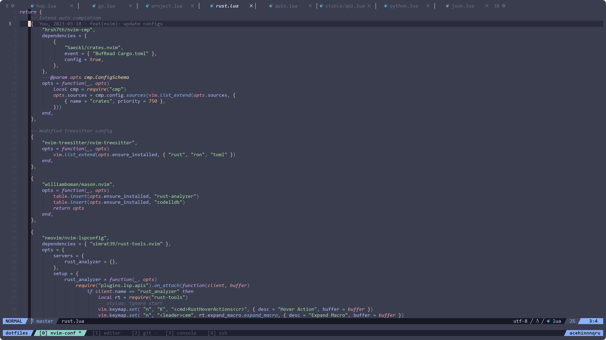

# dotfiles

Rewrote it in nix.

My dotfiles in use. Including configs for tmux, zsh, neovim and alacritty.

- For neovim, mostly about rust, go, web development.
- For zsh, mostly about zinit.
- For tmux, contains some settings and plugins.

# Screenshots



# Usage

## Fresh Installation on new devices

1. Install Nix first

Follow the [Installation Wiki](https://nixos.org/download/#download-nix) to install nix.

2. Add new own host config in [flake.nix](./flake.nix).

Add new host config in the `darwinConfigurations` or `homeConfigurations` section based on the os type.

For example, if you are using a new MacBook, you can add the following config:

```nix
darwinConfigurations = {
  #
  "<here is your hostname>" = mkDarwin {
    username = "<your username>";
    hmModules = [];
    extraimports = [
      {
        system.primaryUser = "<your username>";
        # this line is necessary for the system to be able to use the username.
        users.users."<your username>".uid = 501;
      }
    ];
  };
};
```

3. Follow the instructions in the [Makefile](./Makefile) to build and switch the configuration.

For example, if you are using a new MacBook, you can run the following command:

```bash
make fresh-build-macos hostname=xxx
```

After that, you can run the following command to switch the configuration:

```bash
make switch-macos hostname=xxx
```

After that, you can run the following command to build the configuration:

```bash
make build-macos hostname=xxx
```

If you are using a new Linux system, you can run the following command:

```bash
make fresh-build-linux hostname=xxx
```

After that, you can run the following command to switch the configuration:

```bash
make switch-linux hostname=xxx
```

# Create a new flake based on this one

1. Create a new flake.nix file in the root directory.

```nix
{
  description = "devices' setup flake";

  inputs = {
    base = {
      url = "github:acehinnnqru/dotfiles/master";
    };
  };

  outputs = inputs @ {
    self,
    base,
    ...
  }: let
    mkDarwin = base.packages.aarch64-darwin.mkDarwin;
  in {
    darwinConfigurations = {
      "rqc" = mkDarwin {
        username = "rq.chen";
        hmModules = [];
        extraimports = [
          {
            system.primaryUser = "rq.chen";
            users.users."rq.chen".uid = 501;
            ids.gids.nixbld = 350;
          }
        ];
      };
    };

    # Standalone Home Manager configurations for non-NixOS Linux systems
    # Usage: home-manager switch --flake "github:acehinnnqru/dotfiles#<hostname>"
    homeConfigurations = {
      # Example: Add your remote hostname here
      # "remote-host" = mkHome {
      #   username = "acehinnnqru";
      #   hmModules = [];
      #   system = "x86_64-linux";  # or "aarch64-linux"
      # };
    };
  };
}
```

3. Copy the [Makefile](./Makefile) to the new flake directory.

4. Use the Makefile to build and switch the configuration.