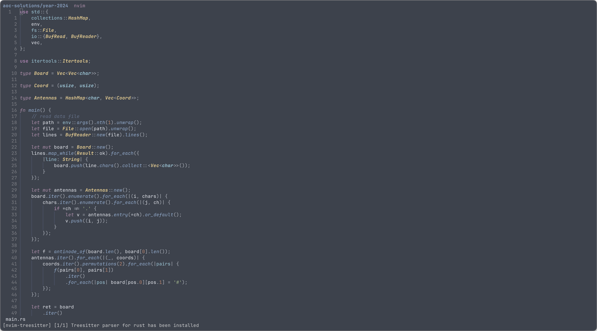

# dotfiles

My dotfiles in use. Including configs for tmux, zsh, neovim and wezterm.

- For neovim, mostly about rust, go, web development.
- For zsh, mostly about zinit.
- For wezterm, contains some basic configs.
- For tmux, contains some settings and plugins.

# Screenshots

